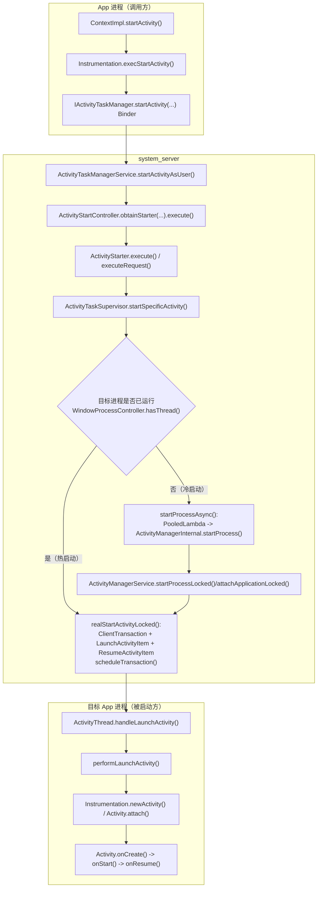

# startActivity 应用启动/界面启动流程（基于 frameworks/base 当前代码）

## 你需要先记住的 5 个概念

1. startActivity 的“入口”在 app 进程，但真正做 Activity 解析/任务栈/窗口切换的核心逻辑在 system\_server 里的 ATMS（ActivityTaskManagerService）。
2. app 进程到 system\_server 的关键跨进程接口是 IActivityTaskManager（Binder）。
3. Android 近些年的 Activity 启动，system\_server 不直接“远程调用 Activity 生命周期方法”，而是通过 ClientTransaction + LaunchActivityItem/ResumeActivityItem 这一套“客户端事务”下发给 ActivityThread。
4. 冷启动时（目标进程不存在），ATMS 不会在持锁状态直接拉起进程，而是通过 ActivityManagerInternal.startProcess 异步让 AMS 去做进程创建，等进程 attach 后再继续后续启动。
5. WMS/WM（WindowManagerService）并不在本文所有步骤中都显式出现，但 Activity 启动的可见性、转场、布局、绘制与配置变化，都在 WM/ATMS 的协作中完成；新手先抓住 ATMS/ActivityThread 主线即可。

## 主流程图（冷启动 + 热启动）

## 技术细节（把“抽象流程”落到真正的代码与数据）

### 1）跨进程边界与参数到底是什么？

startActivity 从 app 进程真正跨进程进入 system\_server 的 Binder 调用是：

- IActivityTaskManager.startActivity(...)

它的关键参数可以按“你调试时最关心的字段”理解：

- caller：发起方进程的 IApplicationThread（用于系统回调、权限归属等）
- callingPackage / callingFeatureId：归属包与 attribution（统计/权限/审计会用）
- intent / resolvedType：要启动的 Intent 与 MIME resolvedType
- resultTo / resultWho / requestCode：用于 startActivityForResult 的回传（非 forResult 时通常是 null/-1）
- startFlags：与启动行为相关的 flags（与 Intent flags 不完全等价）
- profilerInfo：profile/trace 相关
- options：ActivityOptions（动画、LaunchTaskId、display、转场等）

可以从 app 侧一路看到这些参数是怎么填进去的：

- app 侧入口检查与调用 Instrumentation：
  - [ContextImpl.startActivity(Intent, Bundle)](file:///d:/Projects/android/Frameworks/base/core/java/android/app/ContextImpl.java#L1082-L1104)
- execStartActivity 将参数打包并发起 Binder：
  - [Instrumentation.execStartActivity(...)](file:///d:/Projects/android/Frameworks/base/core/java/android/app/Instrumentation.java#L1798-L1844)
- system\_server 侧 ATMS 的 Binder 入口：
  - [ActivityTaskManagerService.startActivity/startActivityAsUser](file:///d:/Projects/android/Frameworks/base/services/core/java/com/android/server/wm/ActivityTaskManagerService.java#L1203-L1294)

### 2）“为什么冷启动还能继续把 Activity 启起来？”——关键在 attachApplicationLocked

很多新手会卡在这里：ATMS 在 startSpecificActivity 里发现进程不存在，只是“启动进程”，那 Activity 是谁在“进程起来之后”真正发下去的？

答案：在 AMS 收到新进程 attach 并完成 bindApplication 之后，会依次尝试“启动等待的 Activity / Service / Broadcast”，其中 Activity 部分交给 ATMS（mAtmInternal）：

- AMS 绑定应用（bindApplication）并让 ATMS 接管“启动等待的 Activity”：
  - [ActivityManagerService.attachApplicationLocked(...)](file:///d:/Projects/android/Frameworks/base/services/core/java/com/android/server/am/ActivityManagerService.java#L4886-L5001)
  - 关键点：`didSomething = mAtmInternal.attachApplication(app.getWindowProcessController())`（同一段代码里还能看到 services/broadcast 的继续分发）
- ATMS LocalService 进入 RootWindowContainer.attachApplication：
  - [ActivityTaskManagerService.LocalService.attachApplication](file:///d:/Projects/android/Frameworks/base/services/core/java/com/android/server/wm/ActivityTaskManagerService.java#L6216-L6236)
- RootWindowContainer 使用 AttachApplicationHelper 扫描“该进程应当承载且可见的 ActivityRecord”，并对每个符合条件的 Activity 调用 realStartActivityLocked 下发 ClientTransaction：
  - [RootWindowContainer.attachApplication](file:///d:/Projects/android/Frameworks/base/services/core/java/com/android/server/wm/RootWindowContainer.java#L1809-L1815)
  - [RootWindowContainer.AttachApplicationHelper](file:///d:/Projects/android/Frameworks/base/services/core/java/com/android/server/wm/RootWindowContainer.java#L3557-L3618)

这就是冷启动链路的闭环：

- startSpecificActivity 负责“是否需要拉起进程”
- attachApplicationLocked/attachApplication 负责“进程起来后把待启动的 Activity 真正投递到该进程”

### 3）热启动/冷启动分叉点：WindowProcessController.hasThread()

真正决定“直接投递启动事务”还是“先拉进程”的判断点非常明确：

- [ActivityTaskSupervisor.startSpecificActivity(...)](file:///d:/Projects/android/Frameworks/base/services/core/java/com/android/server/wm/ActivityTaskSupervisor.java#L1039-L1068)
  - `wpc != null && wpc.hasThread()`：认为目标进程已 attach 并具备 IApplicationThread，可直接 realStartActivityLocked
  - 否则：`mService.startProcessAsync(...)` 走冷启动

补充：startProcessAsync 的“技术理由”写在代码里——为了避免持 ATMS 锁时进入 AMS 造成潜在死锁：

- [ActivityTaskManagerService.startProcessAsync(...)](file:///d:/Projects/android/Frameworks/base/services/core/java/com/android/server/wm/ActivityTaskManagerService.java#L4867-L4882)

### 4）ClientTransaction 里到底塞了什么？LaunchActivityItem/ResumeActivityItem 是什么关系？

system\_server 并不会“远程调用 Activity.onCreate/onResume”，而是：

1. 构造 ClientTransaction（目标进程 thread + 目标 Activity token）
2. addCallback(LaunchActivityItem) 负责“创建 Activity 并调用 performLaunchActivity”
3. setLifecycleStateRequest(ResumeActivityItem 或 PauseActivityItem) 负责“把生命周期推进到期望最终状态”

对应关键源码：

- 组装并下发事务（Launch + 最终生命周期）：
  - [ActivityTaskSupervisor.realStartActivityLocked(...)](file:///d:/Projects/android/Frameworks/base/services/core/java/com/android/server/wm/ActivityTaskSupervisor.java#L900-L930)
- 客户端收到 LaunchActivityItem 后进入 ActivityThread：
  - [LaunchActivityItem.execute(...)](file:///d:/Projects/android/Frameworks/base/core/java/android/app/servertransaction/LaunchActivityItem.java#L82-L103)
  - [ActivityThread.handleLaunchActivity(...)](file:///d:/Projects/android/Frameworks/base/core/java/android/app/ActivityThread.java#L3767-L3812)

新手抓住一个核心：一次 Activity 启动是“一条事务”，里面包含“启动回调 + 最终生命周期请求”，客户端（ActivityThread）按事务驱动去执行。

### 5）锁与线程（你排查死锁/卡顿时必须知道）

- app 进程：
  - startActivity 通常发生在主线程
  - 跨进程通过 Binder 到 system\_server
- system\_server：
  - ATMS 的核心状态受 WM 全局锁保护（mGlobalLock / mGlobalLockWithoutBoost）
  - 冷启动时避免“持 WM 锁直接调用 AMS”，因此通过 startProcessAsync 发消息，再经 ActivityManagerInternal.startProcess 进入 AMS
- “进程起来之后继续启动 Activity”的路径在 AMS.attachApplicationLocked，那里会调用 ATMS.attachApplication 扫描并投递待启动 Activity

## 逐函数状态机（ActivityStarter.executeRequest 内部子阶段）

这部分把 ActivityStarter.executeRequest 拆成“按顺序发生的子阶段”，你可以对照源码逐段单步，看到每一条 if/return 是怎么把启动短路掉的。

总入口（整段函数范围）：

- [ActivityStarter.executeRequest(...)](file:///d:/Projects/android/Frameworks/base/services/core/java/com/android/server/wm/ActivityStarter.java#L849-L1236)

### 阶段 0：解包 Request（把参数变成局部变量）

- 将 caller/intent/aInfo/rInfo/options/resultTo 等从 Request 中取出：
  - [ActivityStarter.executeRequest(...):L857-L877](file:///d:/Projects/android/Frameworks/base/services/core/java/com/android/server/wm/ActivityStarter.java#L857-L877)

这里的 Request 本质是“ATMS 把 Binder 入参整理好的一个启动请求对象”，后续所有子阶段都在围绕这些字段做校验/改写/重定向。

### 阶段 1：定位 callerApp（WindowProcessController），矫正 callingPid/callingUid

- 通过 IApplicationThread 找到调用方的进程控制器，并把 callingPid/callingUid 修正为真实值：
  - [ActivityStarter.executeRequest(...):L883-L894](file:///d:/Projects/android/Frameworks/base/services/core/java/com/android/server/wm/ActivityStarter.java#L883-L894)

这一步的意义：后续权限/后台启动限制（BAL）、拦截器判断等，都需要“真实调用方 uid/pid”。

### 阶段 2：构造 sourceRecord/resultRecord（forResult 相关）

- 从 resultTo 的 IBinder token 反查 sourceRecord（可能为 null）：
  - [ActivityStarter.executeRequest(...):L903-L915](file:///d:/Projects/android/Frameworks/base/services/core/java/com/android/server/wm/ActivityStarter.java#L903-L915)

### 阶段 3：处理 FLAG\_ACTIVITY\_FORWARD\_RESULT（结果转发）

- 如果 intent 带 FORWARD\_RESULT，且 sourceRecord 存在，会把 resultTo/resultWho/requestCode “转移”到新 activity：
  - [ActivityStarter.executeRequest(...):L917-L949](file:///d:/Projects/android/Frameworks/base/services/core/java/com/android/server/wm/ActivityStarter.java#L917-L949)

典型场景：Chooser/Trampoline activity 作为“中转站”，最终目标 activity 需要把结果回给最初发起者。

### 阶段 4：Intent/ActivityInfo 兜底失败（最早的快速失败点）

- component 未解析出来：START\_INTENT\_NOT\_RESOLVED
- ActivityInfo 为空：START\_CLASS\_NOT\_FOUND
  - [ActivityStarter.executeRequest(...):L951-L961](file:///d:/Projects/android/Frameworks/base/services/core/java/com/android/server/wm/ActivityStarter.java#L951-L961)

### 阶段 5：Voice 相关校验（voice task / voice session）

- sourceRecord 属于 voice task 时，对 CATEGORY\_VOICE 支持做额外校验：
  - [ActivityStarter.executeRequest(...):L963-L984](file:///d:/Projects/android/Frameworks/base/services/core/java/com/android/server/wm/ActivityStarter.java#L963-L984)
- 新的 voiceSession 启动同样需要校验目标是否支持：
  - [ActivityStarter.executeRequest(...):L986-L1000](file:///d:/Projects/android/Frameworks/base/services/core/java/com/android/server/wm/ActivityStarter.java#L986-L1000)

### 阶段 6：权限/防火墙/权限策略（StartAnyActivityPermission + IntentFirewall + PermissionPolicy）

这是最核心的“安全短路点”，任何一项不通过都会导致 abort：

- `checkStartAnyActivityPermission(...)`
- `mIntentFirewall.checkStartActivity(...)`
- `PermissionPolicyInternal.checkStartActivity(...)`
  - [ActivityStarter.executeRequest(...):L1014-L1022](file:///d:/Projects/android/Frameworks/base/services/core/java/com/android/server/wm/ActivityStarter.java#L1014-L1022)

### 阶段 7：合并 ActivityOptions（SafeActivityOptions -> ActivityOptions）

- options.getOptions(...) 会把两份 options 合并（realCallerOptions 优先）：
  - [ActivityStarter.executeRequest(...):L1023-L1026](file:///d:/Projects/android/Frameworks/base/services/core/java/com/android/server/wm/ActivityStarter.java#L1023-L1026)

### 阶段 8：后台启动限制 BAL（BackgroundActivityStartController）

这里会产出一个 balCode（允许/拦截/特殊原因码），后续会影响：

- 是否 resumeAppSwitches
- startActivityInner 中是否允许 certain launch path

对应源码：

- [ActivityStarter.executeRequest(...):L1027-L1049](file:///d:/Projects/android/Frameworks/base/services/core/java/com/android/server/wm/ActivityStarter.java#L1027-L1049)

### 阶段 9：RemoteAnimation options override（可选）

- PendingRemoteAnimationRegistry.overrideOptionsIfNeeded：
  - [ActivityStarter.executeRequest(...):L1051-L1055](file:///d:/Projects/android/Frameworks/base/services/core/java/com/android/server/wm/ActivityStarter.java#L1051-L1055)

### 阶段 10：IActivityController 回调（ActivityManager 的“看门人”）

- `mService.mController.activityStarting(...)`，返回 false 会 abort：
  - [ActivityStarter.executeRequest(...):L1056-L1066](file:///d:/Projects/android/Frameworks/base/services/core/java/com/android/server/wm/ActivityStarter.java#L1056-L1066)

### 阶段 11：ActivityStartInterceptor（静默模式/用户不可用/包被 suspend 等拦截与重定向）

- interceptor 会在命中时改写 intent/aInfo/rInfo/resolvedType/options/callingUid 等：
  - [ActivityStarter.executeRequest(...):L1068-L1086](file:///d:/Projects/android/Frameworks/base/services/core/java/com/android/server/wm/ActivityStarter.java#L1068-L1086)

### 阶段 12：统一 abort 处理（对 caller “假装成功”，但 result 取消）

- abort 时会 sendResult(RESULT\_CANCELED) + ActivityOptions.abort，并返回 START\_ABORTED：
  - [ActivityStarter.executeRequest(...):L1088-L1097](file:///d:/Projects/android/Frameworks/base/services/core/java/com/android/server/wm/ActivityStarter.java#L1088-L1097)

### 阶段 13：权限审查重定向（Permissions Review Activity）

当目标包需要 review permissions 时，会把 intent 重写为 ACTION\_REVIEW\_PERMISSIONS，并塞一个 IntentSender（review 完成后再启动原 intent）：

- [ActivityStarter.executeRequest(...):L1099-L1160](file:///d:/Projects/android/Frameworks/base/services/core/java/com/android/server/wm/ActivityStarter.java#L1099-L1160)

### 阶段 14：Instant App/ephemeral 安装器重定向（auxiliaryInfo）

当 resolve 得到 auxiliaryInfo 时，不直接启动原 intent，而是启动安装器/解析器：

- [ActivityStarter.executeRequest(...):L1162-L1178](file:///d:/Projects/android/Frameworks/base/services/core/java/com/android/server/wm/ActivityStarter.java#L1162-L1178)

### 阶段 15：构建 ActivityRecord（启动的“系统侧实体”）

把所有最终参数固化为 ActivityRecord（后续 task/stack/transition/事务下发都围绕它）：

- [ActivityRecord.Builder.build()](file:///d:/Projects/android/Frameworks/base/services/core/java/com/android/server/wm/ActivityStarter.java#L1187-L1205)

### 阶段 16：resumeAppSwitches + 进入 startActivityUnchecked（真正开始“落地到任务栈”）

- 根据 balCode/homeProcess 决定是否恢复 app switches，然后调用 startActivityUnchecked：
  - [ActivityStarter.executeRequest(...):L1214-L1230](file:///d:/Projects/android/Frameworks/base/services/core/java/com/android/server/wm/ActivityStarter.java#L1214-L1230)

## 逐函数状态机（startActivityUnchecked / startActivityInner：任务栈与窗口侧“落地阶段”）

startActivityUnchecked 的角色：持 WM 锁、建立 transition、defer layout，然后进入 startActivityInner，并在失败时做清理收尾：

- [ActivityStarter.startActivityUnchecked(...)](file:///d:/Projects/android/Frameworks/base/services/core/java/com/android/server/wm/ActivityStarter.java#L1376-L1412)

startActivityInner 的角色：决定“复用哪个 task / 是否新建 task / 是否 deliverToTop / rootTask/display 选择 / 是否真正创建新的 ActivityRecord 以及是否 resume”：

- 入口与关键阶段串起来看：
  - [ActivityStarter.startActivityInner(...):L1543-L1627](file:///d:/Projects/android/Frameworks/base/services/core/java/com/android/server/wm/ActivityStarter.java#L1543-L1627)
  - 阶段要点：setInitialState -> computeLaunchingTaskFlags -> getReusableTask/computeTargetTask -> recycleTask/deliverToCurrentTopIfNeeded -> getOrCreateRootTask -> setNewTask

## 源码主线（按“你在 IDE 里该怎么点”的顺序）

### 1）App 进程：ContextImpl.startActivity -> Instrumentation.execStartActivity

关键入口：

- ContextImpl.startActivity(Intent, Bundle)
  - 会做“非 Activity Context 启动必须带 FLAG\_ACTIVITY\_NEW\_TASK”的检查
  - 然后调用 mMainThread.getInstrumentation().execStartActivity(...)

对应源码：

- frameworks/base/core/java/android/app/ContextImpl.java
  - startActivity(Intent, Bundle) -> Instrumentation.execStartActivity(...)

Instrumentation 做了两件重要的事：

1. 调用 intent.prepareToLeaveProcess(who) 做跨进程前的准备
2. 通过 Binder 调用 ActivityTaskManager.getService().startActivity(...)

对应源码：

- frameworks/base/core/java/android/app/Instrumentation.java
  - execStartActivity(...) -> ActivityTaskManager.getService().startActivity(...)

### 1.5）按真实代码顺序走一遍

这条链路可以按真实源码顺序拆成 9 步：

1. `ContextImpl.startActivity(...)` 做入口检查，调用 `Instrumentation.execStartActivity(...)`
2. `Instrumentation.execStartActivity(...)` 通过 `ActivityTaskManager.getService().startActivity(...)` 发起 `IActivityTaskManager` Binder
3. `ActivityTaskManagerService.startActivityAsUser(...)` 收到 Binder 请求，调用 `obtainStarter(...).execute()`
4. `ActivityStarter.execute()` -> `executeRequest(...)`，先做 resolve、权限/BAL/拦截器、`ActivityRecord` 构建，再进入 `startActivityUnchecked(...)`
5. `ActivityStarter.startActivityUnchecked(...)` -> `startActivityInner(...)`，决定复用 task / 创建 task / deliverToTop，并调用 `startSpecificActivity(...)`
6. `ActivityTaskSupervisor.startSpecificActivity(...)` 根据 `WindowProcessController.hasThread()` 判断“热启动/冷启动”
7. 冷启动时走 `startProcessAsync(...)` -> `ActivityManagerInternal.startProcess(...)` -> `ActivityManagerService.startProcessLocked(...)` -> `ActivityManagerService.attachApplicationLocked(...)` -> `ActivityTaskManagerService.LocalService.attachApplication(...)`
8. 无论热启动还是冷启动，最终由 `ActivityTaskSupervisor.realStartActivityLocked(...)` 创建 `ClientTransaction`，加入 `LaunchActivityItem`、`ResumeActivityItem`，调用 `scheduleTransaction(...)`
9. 目标 app 进程 `ActivityThread` 收到事务并执行：`LaunchActivityItem.execute(...)` -> `ActivityThread.handleLaunchActivity(...)` -> `ActivityThread.performLaunchActivity(...)` -> `Activity.attach(...)` -> `Activity.onCreate()` -> `Activity.onStart()` -> `Activity.onResume()`

这就是“你在 IDE 里从上到下跳一遍”的最小可对照链路。

### 2）跨进程：IActivityTaskManager.startActivity

这是 app 进程进入 system\_server 的关键跨进程点（Binder 接口定义）：

- frameworks/base/core/java/android/app/IActivityTaskManager.aidl
  - startActivity(...)
  - startActivityAsUser(...)

### 3）system\_server：ATMS 入口 ActivityTaskManagerService.startActivityAsUser

ATMS 收到 Binder 请求后：

1. 做调用者校验（包名与 UID 等）
2. 将请求参数“灌入” ActivityStarter
3. 调用 execute() 进入统一启动管线

对应源码：

- frameworks/base/services/core/java/com/android/server/wm/ActivityTaskManagerService.java
  - startActivity(...) -> startActivityAsUser(...)
  - obtainStarter(intent, "startActivityAsUser").setXxx(...).execute()

### 4）system\_server：ActivityStarter.execute（解析、校验、构建启动请求）

ActivityStarter.execute() 的新手关注点：

- 若调用方没提供 ActivityInfo，会在这里 resolveActivity()
- 进入 executeRequest(mRequest) 做真正的“启动决策与落地”

对应源码：

- frameworks/base/services/core/java/com/android/server/wm/ActivityStarter.java
  - execute()

### 5）system\_server：决定“热启动/冷启动”的关键点 startSpecificActivity

ActivityTaskSupervisor.startSpecificActivity(...) 做了“目标进程是否存在并有线程”的判断：

- 若 WindowProcessController 存在且 hasThread()，直接 realStartActivityLocked（热启动/已存在进程）
- 否则走 startProcessAsync，让 AMS 去创建进程（冷启动）

对应源码：

- frameworks/base/services/core/java/com/android/server/wm/ActivityTaskSupervisor.java
  - startSpecificActivity(ActivityRecord r, boolean andResume, boolean checkConfig)

### 6）冷启动：ATMS -> AMS 异步拉起进程 -> attachApplicationLocked

为什么是“异步”：

- ATMS/WM 有自己的全局锁（mGlobalLock），直接在持锁时调用 AMS 可能造成死锁
- 所以 startProcessAsync 通过 Handler 发消息到 ATMS 自己的线程，再通过 ActivityManagerInternal.startProcess 进入 AMS

对应源码：

- frameworks/base/services/core/java/com/android/server/wm/ActivityTaskManagerService.java
  - startProcessAsync(...)（用 PooledLambda 发消息，避免持 WM 锁进入 AMS）

AMS 侧进程启动与 attach：

- frameworks/base/services/core/java/com/android/server/am/ActivityManagerService.java
  - attachApplicationLocked(IApplicationThread thread, int pid, int callingUid, long startSeq)

新手理解到这里即可：冷启动时，先“把进程弄出来并 attach”，后续 Activity 才能通过 app 的 ApplicationThread/ActivityThread 下发启动事务。

### 7）真正把 Activity “发到 app 进程执行”：realStartActivityLocked -> ClientTransaction

realStartActivityLocked(...) 做的关键事：

1. 构造 ClientTransaction(proc.getThread(), r.token)
2. addCallback(LaunchActivityItem.obtain(...))
3. setLifecycleStateRequest(ResumeActivityItem.obtain(...))（或 PauseActivityItem）
4. mService.getLifecycleManager().scheduleTransaction(clientTransaction)

这意味着：system\_server 侧“组织好一次 Activity 启动需要的所有数据”，再一次性下发给客户端执行。

对应源码：

- frameworks/base/services/core/java/com/android/server/wm/ActivityTaskSupervisor.java
  - realStartActivityLocked(...) 内部创建 ClientTransaction，加入 LaunchActivityItem/ResumeActivityItem 并 scheduleTransaction()

### 8）目标 App 进程：LaunchActivityItem.execute -> ActivityThread.handleLaunchActivity

LaunchActivityItem 收到后会调用：

- client.handleLaunchActivity(...)

对应源码：

- frameworks/base/core/java/android/app/servertransaction/LaunchActivityItem.java
  - execute(...) -> client.handleLaunchActivity(...)

而 ActivityThread.handleLaunchActivity(...) 里最终会：

- performLaunchActivity(...)（创建 Activity 实例、attach、调用 onCreate）
- 后续由事务的 lifecycle request 触发 resume

对应源码：

- frameworks/base/core/java/android/app/ActivityThread.java
  - handleLaunchActivity(...)

## 关键“分叉点”总结（新手最容易迷路的地方）

### 分叉点 A：谁在调用 startActivity？

- 从 Activity 内部调用：通常已有 token/resultTo，可能走 startActivityForResult 等路径
- 从非 Activity Context 调用：ContextImpl 会强制要求 FLAG\_ACTIVITY\_NEW\_TASK（否则抛异常）

入口检查在：

- frameworks/base/core/java/android/app/ContextImpl.java
  - startActivity(Intent, Bundle) 对 NEW\_TASK 的检查

### 分叉点 B：目标进程是否存在？

判断点在：

- frameworks/base/services/core/java/com/android/server/wm/ActivityTaskSupervisor.java
  - startSpecificActivity(...)：WindowProcessController.hasThread()

### 分叉点 C：Activity 是否立刻进入 RESUMED？

realStartActivityLocked 里根据 andResume 决定下发 ResumeActivityItem 还是 PauseActivityItem：

- andResume=true：启动后立刻 resume
- andResume=false：启动后先处于 paused（用于某些过渡状态/场景）

## 新手调试建议（抓“能看到的证据”）

1. 先从 app 侧打点：ContextImpl.startActivity -> Instrumentation.execStartActivity
2. system\_server 侧抓入口：ActivityTaskManagerService.startActivityAsUser
3. 进程是否拉起：看 ActivityTaskSupervisor.startSpecificActivity 是否走 startProcessAsync
4. Activity 是否真的到达 app：看 realStartActivityLocked 是否 scheduleTransaction(LaunchActivityItem)
5. app 侧是否真的创建了 Activity：看 ActivityThread.handleLaunchActivity/performLaunchActivity

