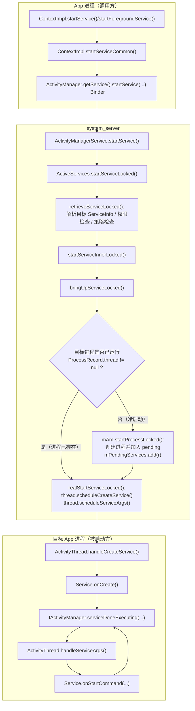

# ServiceStart 流程（startService / startForegroundService）（基于 frameworks/base 当前代码）

## 你需要先记住的 5 个概念

1. startService/startForegroundService 的 app 侧入口在 ContextImpl，但“是否允许启动、如何拉起进程、如何回调到 Service.onCreate/onStartCommand”都在 system_server 的 AMS/ActiveServices 完成。
2. system_server 用 ServiceRecord 作为“服务实例的系统侧描述”，用 ProcessRecord/WindowProcessController 表示进程，用 IApplicationThread（app 进程 Binder 句柄）把请求派发回 app 进程执行。
3. bringUpServiceLocked 是一个核心枢纽：进程已存在就直接 realStartServiceLocked；进程不存在就 startProcessLocked 并把 ServiceRecord 放入 pending，等进程起来再继续。
4. realStartServiceLocked 会通过 IApplicationThread.scheduleCreateService 和 scheduleServiceArgs 把“创建服务”和“投递 start 参数”下发给 ActivityThread。
5. startForegroundService 相比 startService，多了“前台服务启动限制/超时必须调用 startForeground()”等策略，失败时可能抛出 ForegroundServiceStartNotAllowedException 或返回特殊 ComponentName（ContextImpl 会转成异常）。

## 主流程图（包含：进程存在/不存在、创建 service、投递 startArgs）

## 1.5）按真实代码顺序走一遍

这条链路可以按真实源码顺序拆成 9 步：

1. `ContextImpl.startServiceCommon(...)` / `ContextImpl.startForegroundServiceCommon(...)` 做 `validateServiceIntent(...)`、`service.prepareToLeaveProcess(this)`，并调用 `ActivityManager.getService().startService(...)`
2. `ActivityManagerService.startService(...)` 收到 Binder 请求，在 `synchronized(this)` 内调用 `mServices.startServiceLocked(...)`
3. `ActiveServices.startServiceLocked(...)` 解析目标 `ServiceInfo`、做权限/后台启动/foreground 服务限制检查，进入 `startServiceInnerLocked(...)`
4. `ActiveServices.bringUpServiceLocked(...)` 决定“进程已存在直接 realStartServiceLocked”还是“进程不存在先拉起并挂起 pending”
5. 进程已存在时，`ActiveServices.realStartServiceLocked(...)` 调用 `thread.scheduleCreateService(...)` 并通过 `sendServiceArgsLocked(...)` 下发 `scheduleServiceArgs(...)`
6. 进程不存在时，`mAm.startProcessLocked(...)` 拉起进程，等待 `ActivityManagerService.attachApplicationLocked(...)`
7. `ActivityManagerService.attachApplicationLocked(...)` 调用 `ActiveServices.attachApplicationLocked(...)`，将 `mPendingServices` 里的 ServiceRecord 取出并继续 `realStartServiceLocked(...)`
8. 目标 app 进程 `ActivityThread.handleCreateService(...)` 创建 Service 实例、`service.attach(...)`、`service.onCreate()`，并回 `serviceDoneExecuting(...)`
9. 目标 app 进程 `ActivityThread.handleServiceArgs(...)` 投递 `Service.onStartCommand(...)`，执行后再回 `serviceDoneExecuting(...)`

这就是“你在 IDE 里从上到下跳一遍”的最小可对照链路。

## 技术细节（把“启动 Service”拆成系统真正做的几件事）

### 1）app 侧到底发了什么 Binder 调用？AMS 返回值为什么有时很怪？

app 进程实际跨进程调用的是：

- ActivityManager.getService().startService(callerThread, intent, resolvedType, requireForeground, callingPackage, callingFeatureId, userId)

对应源码（你可以直接从这里开始单步）：

- [ContextImpl.startServiceCommon(...)](file:///d:/Projects/android/Frameworks/base/core/java/android/app/ContextImpl.java#L1848-L1924)
- [ActivityManagerService.startService(...)](file:///d:/Projects/android/Frameworks/base/services/core/java/com/android/server/am/ActivityManagerService.java#L12541-L12572)

这里最容易困惑的是 AMS 返回的 ComponentName 可能是“特殊值”，ContextImpl 会把它翻译成异常：

- 包名为 `"!"`：权限/导出等问题（ContextImpl 抛 SecurityException）
- 包名为 `"!!"`：系统侧明确失败原因（ContextImpl 抛 SecurityException）
- 包名为 `"?"`：后台启动限制等策略拒绝（ContextImpl 抛 ServiceStartNotAllowedException）

这段映射逻辑就在：

- [ContextImpl.startServiceCommon(...)](file:///d:/Projects/android/Frameworks/base/core/java/android/app/ContextImpl.java#L1898-L1911)

### 2）ActiveServices.startServiceLocked：为什么这里“策略特别多”？

ActiveServices.startServiceLocked(...) 不只是“查到 ServiceInfo 然后启动”，它还要做一堆“能不能启动”的判断：

- 解析与权限：retrieveServiceLocked(...) 产出 ServiceRecord
- 背景限制/待机限制：
  - `bgLaunch = !mAm.isUidActiveLOSP(r.appInfo.uid)`（是否后台启动）
  - `getAppStartModeLOSP(...)`（是否允许后台启动 service）
- startForegroundService 额外限制：
  - `r.mAllowStartForeground` + `AppOpsManager.OP_START_FOREGROUND`
  - 被拒绝时可能抛 ForegroundServiceStartNotAllowedException

对应源码（含关键判断点）：

- [ActiveServices.startServiceLocked(...)](file:///d:/Projects/android/Frameworks/base/services/core/java/com/android/server/am/ActiveServices.java#L682-L824)

### 3）bringUpServiceLocked：Service 冷启动的“挂起点”与 mPendingServices

bringUpServiceLocked(...) 是你理解“进程不存在时如何继续”的关键：

- 进程已存在且 thread 不为空：直接 realStartServiceLocked（立刻 scheduleCreateService/scheduleServiceArgs）
- 进程不存在：mAm.startProcessLocked(...) 拉起进程，并把 ServiceRecord 放入 mPendingServices 等待 attach

对应源码：

- [ActiveServices.bringUpServiceLocked(...)](file:///d:/Projects/android/Frameworks/base/services/core/java/com/android/server/am/ActiveServices.java#L4164-L4331)
  - 直接启动：`realStartServiceLocked(...)`（#L4245-L4247）
  - 冷启动挂起：`mPendingServices.add(r)`（#L4317-L4319）

### 4）进程起来之后，谁把 pending 的 Service 真正启动起来？——ActiveServices.attachApplicationLocked

当新进程 attach 到 AMS 后，AMS.attachApplicationLocked 会调用：

- `mServices.attachApplicationLocked(app, processName)`（把等待该进程的 Service 拉起来）

在 ActiveServices.attachApplicationLocked 里，会遍历 mPendingServices，把匹配到该进程的 ServiceRecord 取出来并 realStartServiceLocked：

- [ActiveServices.attachApplicationLocked(...)](file:///d:/Projects/android/Frameworks/base/services/core/java/com/android/server/am/ActiveServices.java#L5112-L5190)
  - `realStartServiceLocked(sr, proc, thread, pid, uidRecord, ...)`（#L5138-L5140）

这就是 Service 冷启动链路的闭环：

- bringUpServiceLocked 负责“启动进程 + 把 service 放进 pending”
- attachApplicationLocked 负责“进程起来后把 pending service 真正投递到该进程”

### 5）realStartServiceLocked：下发到 app 进程的两个关键 one-way 调用

realStartServiceLocked 做了两类重要动作：

1. 创建 Service 实例（只做一次）：`thread.scheduleCreateService(...)`
2. 投递 onStartCommand 参数（可能多次）：`r.app.getThread().scheduleServiceArgs(r, slice)`

对应源码：

- [ActiveServices.realStartServiceLocked(...)](file:///d:/Projects/android/Frameworks/base/services/core/java/com/android/server/am/ActiveServices.java#L4357-L4463)
- sendServiceArgsLocked 中 scheduleServiceArgs 的地方：
  - [ActiveServices.sendServiceArgsLocked(...)](file:///d:/Projects/android/Frameworks/base/services/core/java/com/android/server/am/ActiveServices.java#L4488-L4530)

### 6）startForegroundService 的“技术细节”：超时、ANR、Crash 三件套

当你用 startForegroundService 启动 Service（fgRequired=true）时，系统会强制要求：

- Service 必须在超时窗口内调用 Service.startForeground()

实现方式：

- sendServiceArgsLocked 看到 `r.fgRequired && !r.fgWaiting` 且 `!r.isForeground` 时，会安排超时消息：
  - [ActiveServices.sendServiceArgsLocked(...)](file:///d:/Projects/android/Frameworks/base/services/core/java/com/android/server/am/ActiveServices.java#L4498-L4509)
- 超时消息的调度在：
  - [ActiveServices.scheduleServiceForegroundTransitionTimeoutLocked(...)](file:///d:/Projects/android/Frameworks/base/services/core/java/com/android/server/am/ActiveServices.java#L5864-L5873)
- 超时后系统可能走两种强硬处理（取决于场景/实现）：
  - 触发 ANR：`serviceForegroundTimeoutANR(...)` -> AnrHelper
  - 触发 crash：`serviceForegroundCrash(...)`（抛 ForegroundServiceDidNotStartInTimeException 类型的崩溃）

对应源码：

- [ActiveServices.serviceForegroundTimeoutANR(...)](file:///d:/Projects/android/Frameworks/base/services/core/java/com/android/server/am/ActiveServices.java#L5823-L5825)
- [ActiveServices.serviceForegroundCrash(...)](file:///d:/Projects/android/Frameworks/base/services/core/java/com/android/server/am/ActiveServices.java#L5843-L5851)

### 7）目标 app 进程：ActivityThread 如何创建 Service、如何回 ACK？

目标进程收到 scheduleCreateService/scheduleServiceArgs 后，在 ActivityThread 里执行：

- 创建 Service：
  - [ActivityThread.handleCreateService(...)](file:///d:/Projects/android/Frameworks/base/core/java/android/app/ActivityThread.java#L4463-L4516)
  - 关键点：`service.onCreate()` 后，会调用 `ActivityManager.getService().serviceDoneExecuting(...)` 做 ACK（否则系统侧会认为该 service 仍在 executing）
- 投递 onStartCommand：
  - [ActivityThread.handleServiceArgs(...)](file:///d:/Projects/android/Frameworks/base/core/java/android/app/ActivityThread.java#L4659-L4692)
  - 关键点：执行完 `onStartCommand` 同样会 `serviceDoneExecuting(...)` 做 ACK

### 8）ServiceRecord 关键字段速查（你看日志/调试时需要“对号入座”）

system_server 用 ServiceRecord 描述一个 service 实例（注意：不是 Java 层 Service 对象本身）。新手最常用、最容易和流程对上的字段如下：

- 进程归属：
  - `processName`：service 希望运行的进程名
  - `app`：当前承载它的 ProcessRecord（未启动/已挂起时可能为 null）
  - `isolationHostProc`：隔离进程/SDK sandbox 这类场景下的宿主进程
- “启动态”相关：
  - `startRequested`：是否有人显式 start 过（startService）
  - `callStart`：是否要求重启后也要回调 onStart（历史兼容语义）
  - `pendingStarts`：尚未投递到 app 的 start 参数队列
  - `deliveredStarts`：已投递过的 start 参数
- “前台服务”相关：
  - `fgRequired`：是否要求启动后进入前台（startForegroundService 的合同）
  - `fgWaiting`：是否已安排“必须 startForeground 的超时”
  - `isForeground`：当前是否已经处于前台服务状态
- “执行/超时”相关：
  - `executeNesting` / `executeFg`：系统侧用于跟踪“还有多少正在执行的 service 操作”，配合超时/ANR

对应源码（字段定义）：

- [ServiceRecord.java:L90-L166](file:///d:/Projects/android/Frameworks/base/services/core/java/com/android/server/am/ServiceRecord.java#L90-L166)
- [ServiceRecord.java:L304-L307](file:///d:/Projects/android/Frameworks/base/services/core/java/com/android/server/am/ServiceRecord.java#L304-L307)

## 逐函数状态机（executeNesting / 超时消息流：为什么 service 会触发 ANR）

这部分回答一个非常“工程化”的问题：system_server 怎么知道某个 Service 的 onCreate/onStartCommand/onBind 卡住了？答案是：在 system_server 内部对“正在执行的 service 操作”做计数与打时间戳，然后用 Handler 消息做超时检测。

### 1）进入 executing 状态：bumpServiceExecutingLocked（计数 + 打点 + 安排超时）

任何一次需要 app 侧执行的 service 事务（start/bind 等）在下发到 app 进程前，都会先调用 bumpServiceExecutingLocked，把 ServiceRecord 标记为 executing：

- `r.executeNesting++`
- `r.executingStart = uptimeMillis()`
- 进程维度：ProcessServiceRecord.startExecutingService(r)
- 如果这是该进程第 1 个 executing service，则安排 SERVICE_TIMEOUT_MSG

对应源码：

- [ActiveServices.bumpServiceExecutingLocked(...)](file:///d:/Projects/android/Frameworks/base/services/core/java/com/android/server/am/ActiveServices.java#L3597-L3661)
  - 关键点：`if (timeoutNeeded && psr.numberOfExecutingServices() == 1) scheduleServiceTimeoutLocked(r.app);`（#L3636-L3638）

安排超时消息（前台/后台两个不同超时）：

- [ActiveServices.scheduleServiceTimeoutLocked(...)](file:///d:/Projects/android/Frameworks/base/services/core/java/com/android/server/am/ActiveServices.java#L5853-L5862)
  - `shouldExecServicesFg()` 为 true 用 SERVICE_TIMEOUT，否则用 SERVICE_BACKGROUND_TIMEOUT

### 2）app 侧 ACK：serviceDoneExecuting -> system_server 递减 executeNesting

app 进程执行完 Service 的 onCreate/onStartCommand/onBind 等后，会调用：

- IActivityManager.serviceDoneExecuting(...)

system_server 收到后会做两件事：

1. 业务语义记账（例如 START_STICKY/REDELIVER 的 StartItem 处理）
2. 递减 executeNesting，并在归零时取消/重排超时消息

对应源码：

- 处理 startId/StartItem 语义：
  - [ActiveServices.serviceDoneExecutingLocked(...):L4954-L5034](file:///d:/Projects/android/Frameworks/base/services/core/java/com/android/server/am/ActiveServices.java#L4954-L5034)
- 真正递减 executeNesting、取消 SERVICE_TIMEOUT_MSG：
  - [ActiveServices.serviceDoneExecutingLocked(...):L5050-L5089](file:///d:/Projects/android/Frameworks/base/services/core/java/com/android/server/am/ActiveServices.java#L5050-L5089)
  - 关键点：`r.executeNesting--;`（#L5057）与 `removeMessages(SERVICE_TIMEOUT_MSG, r.app)`（#L5068）

### 3）超时消息如何走到 ANR：SERVICE_TIMEOUT_MSG -> serviceTimeout -> AnrHelper

消息分发入口在 AMS 的 Handler：

- [ActivityManagerService MainHandler: SERVICE_TIMEOUT_MSG](file:///d:/Projects/android/Frameworks/base/services/core/java/com/android/server/am/ActivityManagerService.java#L1694-L1699)
  - `mServices.serviceTimeout((ProcessRecord) msg.obj)`

serviceTimeout 的核心逻辑：

- 从 proc.mServices 里遍历 executing services，找 executingStart 最早、且超过阈值的 ServiceRecord
- 命中超时且进程仍在 LRU：构造 anrMessage，交给 AnrHelper
- 否则（还没到最早超时点）：把下一次检查时间“重排到 nextTime + timeout”

对应源码：

- [ActiveServices.serviceTimeout(...)](file:///d:/Projects/android/Frameworks/base/services/core/java/com/android/server/am/ActiveServices.java#L5738-L5787)
  - 关键点：`if (sr.executingStart < maxTime) timeout = sr;`（#L5756-L5758）
  - 触发 ANR：`mAm.mAnrHelper.appNotResponding(proc, anrMessage)`（#L5784-L5786）

### 4）FGS 两阶段超时：SERVICE_FOREGROUND_TIMEOUT_MSG（没及时 startForeground）

startForegroundService 相关的超时分两层：

1. “必须尽快进入前台”的判定：sendServiceArgsLocked 里看到 fgRequired 且未 foreground，会安排 transition timeout（前面文档第 6 节已引用）
2. timeout 到点后 stopServiceLocked，并再延迟一段时间触发 ANR（或另一路触发 crash）

对应源码（消息分发与处理）：

- [ActivityManagerService MainHandler: SERVICE_FOREGROUND_TIMEOUT_MSG](file:///d:/Projects/android/Frameworks/base/services/core/java/com/android/server/am/ActivityManagerService.java#L1697-L1705)
- [ActiveServices.serviceForegroundTimeout(...)](file:///d:/Projects/android/Frameworks/base/services/core/java/com/android/server/am/ActiveServices.java#L5789-L5821)

## 源码主线（按主调用链）

ContextImpl 的行为要点：

- validateServiceIntent(service)：新版本要求 Service Intent 显式（component 或 package）
- service.prepareToLeaveProcess(this)：跨进程前整理 Intent
- Binder 调用 AMS：ActivityManager.getService().startService(...)
- AMS 返回 ComponentName 可能是特殊值：
  - 包名为 "!" / "!!" / "?" 代表权限/策略拒绝，ContextImpl 会抛 SecurityException 或 ServiceStartNotAllowedException

对应源码：

- frameworks/base/core/java/android/app/ContextImpl.java
  - startService() / startForegroundService()
  - startServiceCommon(...)

### 2）system_server 入口：ActivityManagerService.startService

AMS 入口的行为要点：

- enforceNotIsolatedCaller("startService")
- 在 synchronized(this) 内调用 mServices.startServiceLocked(...)

对应源码：

- frameworks/base/services/core/java/com/android/server/am/ActivityManagerService.java
  - startService(...)

### 3）ActiveServices.startServiceLocked：策略检查 + 取 ServiceRecord

ActiveServices.startServiceLocked(...) 是“策略密集区”，新手优先抓这些点：

1. retrieveServiceLocked(...)：解析 ServiceInfo/权限/用户等，得到 ServiceRecord
2. 前台服务（fgRequired）相关限制：
   - mAllowStartForeground、AppOps(OP_START_FOREGROUND) 等检查
3. 后台启动限制：
   - getAppStartModeLOSP(...)，可能返回 APP_START_MODE_DELAYED/disabled 等
4. 最终进入 startServiceInnerLocked(...)，再 bringUpServiceLocked(...)

对应源码：

- frameworks/base/services/core/java/com/android/server/am/ActiveServices.java
  - startServiceLocked(...)
  - startServiceInnerLocked(...)

### 4）bringUpServiceLocked：决定“进程已存在/需要拉起进程”

bringUpServiceLocked 的关键逻辑（新手建议重点看这一段）：

- 如果 r.app != null 且 r.app.getThread() != null：
  - sendServiceArgsLocked(...)（说明服务已在进程里，直接投递 start 参数）
- 否则：
  - 查找/创建目标进程
  - 进程有 thread：realStartServiceLocked(...)（直接进入创建 service）
  - 进程没有 thread：mAm.startProcessLocked(...) 拉起进程，并把 ServiceRecord 放入 mPendingServices

对应源码：

- frameworks/base/services/core/java/com/android/server/am/ActiveServices.java
  - bringUpServiceLocked(...)

### 5）realStartServiceLocked：把“创建 Service/投递 onStartCommand”下发到 app 进程

realStartServiceLocked 的关键调用：

- thread.scheduleCreateService(r, r.serviceInfo, compatInfo, procState)
- sendServiceArgsLocked(...) -> r.app.getThread().scheduleServiceArgs(r, slice)

对应源码：

- frameworks/base/services/core/java/com/android/server/am/ActiveServices.java
  - realStartServiceLocked(...)
  - sendServiceArgsLocked(...)

### 6）目标 App 进程：ActivityThread.handleCreateService / handleServiceArgs

ActivityThread.handleCreateService(...)：

- LoadedApk.makeApplicationInner(...)（确保 Application 已创建）
- instantiateService(...) 创建 Service 实例
- service.attach(...)
- service.onCreate()
- 回调 AMS：ActivityManager.getService().serviceDoneExecuting(...)

ActivityThread.handleServiceArgs(...)：

- 调用 Service.onStartCommand(intent, flags, startId)（或 onTaskRemoved）
- 回调 AMS：serviceDoneExecuting(..., SERVICE_DONE_EXECUTING_START, ...)

对应源码：

- frameworks/base/core/java/android/app/ActivityThread.java
  - handleCreateService(...)
  - handleServiceArgs(...)

## 新手最常见的“看起来启动了但没跑起来”的原因

1. Intent 不是显式：ContextImpl.validateServiceIntent 会拒绝或警告
2. 后台启动限制：ActiveServices.startServiceLocked 可能返回 "?"，ContextImpl 转成 ServiceStartNotAllowedException
3. startForegroundService 后未及时 startForeground：ActiveServices 会安排超时检查（fgRequired/fgWaiting 等逻辑）
4. 目标进程一直起不来：bringUpServiceLocked 里 mAm.startProcessLocked 返回 null（进程被标记 bad / 启动失败）
