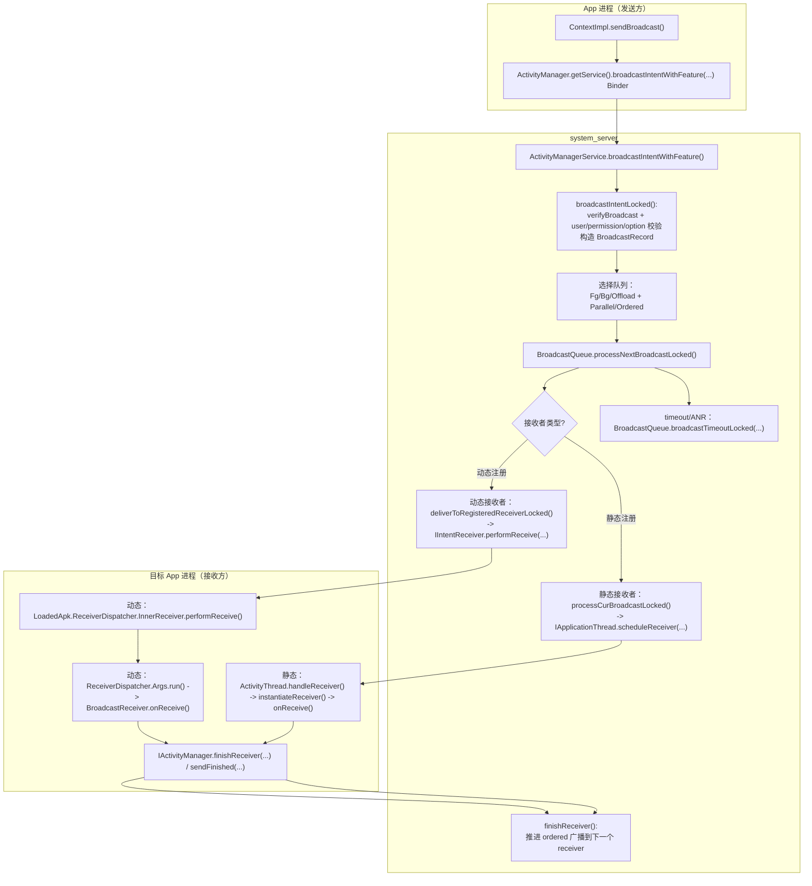

# 广播流程（sendBroadcast / sendOrderedBroadcast）（基于 frameworks/base 当前代码）

## 你需要先记住的 5 个概念

1. 广播发送入口在 app 进程的 ContextImpl，但真正的“匹配接收者 + 权限过滤 + 入队调度 + 超时/ANR”在 system_server 的 AMS + BroadcastQueue 完成。
2. 广播接收者分两类：动态注册（registerReceiver）与静态注册（manifest）。system_server 对它们的投递方式不同。
3. 广播队列分为并行（parallel，非 ordered）和串行（ordered/serialized）两大类；串行广播按 receiver 一个个派发，必须 finishReceiver 才能继续下一个。
4. 动态接收者：system_server 通过 IIntentReceiver.performReceive 直接 Binder 回调到 app 进程的 ReceiverDispatcher.InnerReceiver。
5. 静态接收者：system_server 通过 IApplicationThread.scheduleReceiver 把 ReceiverData 发送到 ActivityThread，由 ActivityThread 实例化 BroadcastReceiver 并调用 onReceive。

## 主流程图（发送 -> 入队 -> 分发：动态/静态两条路）

## 1.5）按真实代码顺序走一遍

这条链路可以按真实源码顺序拆成 9 步：

1. `ContextImpl.sendBroadcast(...)` / `sendOrderedBroadcast(...)` 调用 `intent.prepareToLeaveProcess(this)`，然后通过 `ActivityManager.getService().broadcastIntentWithFeature(...)` 发起 Binder
2. `ActivityManagerService.broadcastIntentWithFeature(...)` 收到请求，调用 `broadcastIntentLocked(...)`，构造 `BroadcastRecord` 并选择目标队列
3. `BroadcastQueue.processNextBroadcastLocked(...)` 取下一条可分发广播，按照 parallel / ordered 决定分发方式
4. parallel 广播执行 `deliverToRegisteredReceiverLocked(...)`，ordered 广播执行 `processCurBroadcastLocked(...)`
5. 对于动态接收者，系统最终走 `IIntentReceiver.performReceive(...)`；对于静态接收者，系统走 `thread.scheduleReceiver(...)`
6. 目标 app 进程动态接收者执行 `LoadedApk.ReceiverDispatcher.InnerReceiver.performReceive(...)` -> `ReceiverDispatcher.Args.run()` -> `BroadcastReceiver.onReceive()`
7. 目标 app 进程静态接收者执行 `ActivityThread.handleReceiver(...)` -> `instantiateReceiver()` -> `receiver.onReceive()`
8. 接收方执行完后通过 `finishReceiver()` / `sendFinished()` 回到 system_server，`ActivityManagerService.finishReceiver(...)` 推进广播队列
9. 若某个 receiver 超时，`BroadcastQueue.broadcastTimeoutLocked(...)` 会强制推进队列，并可能通过 `AnrHelper.appNotResponding(...)` 产生 ANR

这就是“你在 IDE 里从上到下跳一遍”的最小可对照链路。

## 技术细节（把“广播”拆成队列、投递、ACK、超时四个层面）

### 1）发送端真正做了什么？（Intent 的“跨进程准备”）

app 侧 sendBroadcast 的关键动作只有两步：

1. `intent.prepareToLeaveProcess(this)`：跨进程前整理 Intent（比如 ClipData/URI 权限等）
2. Binder 进入 AMS：`broadcastIntentWithFeature(...)`

对应源码：

- [ContextImpl.sendBroadcast(Intent)](file:///d:/Projects/android/Frameworks/base/core/java/android/app/ContextImpl.java#L1188-L1200)
- [ActivityManagerService.broadcastIntentWithFeature(...)](file:///d:/Projects/android/Frameworks/base/services/core/java/com/android/server/am/ActivityManagerService.java#L14485-L14522)

### 2）AMS.broadcastIntentLocked：默认 flag、用户/boot 约束、options 的安全校验

广播从“看起来是 Intent”变成“系统可调度的 BroadcastRecord”，是在 broadcastIntentLocked 里发生的。这里新手最值得记住的技术细节：

- AMS 会复制 Intent：`intent = new Intent(intent)`（避免调用方后续篡改）
- 默认加 `Intent.FLAG_EXCLUDE_STOPPED_PACKAGES`：广播默认不发给 stopped app
- boot 未完成时：会加 `Intent.FLAG_RECEIVER_REGISTERED_ONLY`，避免在早期阶段拉起新进程
- BroadcastOptions 里某些能力（临时 allowlist/允许后台拉起 activity 等）会做强权限校验

对应源码：

- [ActivityManagerService.broadcastIntentLocked(...)](file:///d:/Projects/android/Frameworks/base/services/core/java/com/android/server/am/ActivityManagerService.java#L13645-L13724)

### 3）队列与调度：parallel vs ordered/serialized，为什么 ordered 会“卡住”？

BroadcastQueue.processNextBroadcastLocked 的核心调度策略：

- 并行队列（mParallelBroadcasts）：
  - 非 ordered 广播会直接遍历 receivers 并投递（不需要等待某个 receiver finish）
- 串行队列（ordered/serialized，由 mDispatcher 维护）：
  - 一次只处理一个 receiver
  - 当前 receiver 未 finishReceiver 之前，下一位 receiver 不会被投递
  - 如果目标进程还没起来，会设置 mPendingBroadcast，等待进程 attach 后再继续

对应源码：

- [BroadcastQueue.processNextBroadcastLocked(...)](file:///d:/Projects/android/Frameworks/base/services/core/java/com/android/server/am/BroadcastQueue.java#L1165-L1273)

### 4）动态接收者 vs 静态接收者：system_server 到 app 进程的“投递通道”完全不同

#### A）动态注册（registerReceiver）：走 IIntentReceiver.performReceive / scheduleRegisteredReceiver

动态接收者的投递，系统最终会走到 performReceiveLocked：

- 若 app 进程存在（有 IApplicationThread）：
  - `thread.scheduleRegisteredReceiver(receiver, intent, ...)`（通过目标进程的 ApplicationThread 排队，保证 one-way 调用顺序）
- 若不存在：
  - 直接 `receiver.performReceive(...)`（走 IIntentReceiver 的 one-way 回调）

对应源码：

- [BroadcastQueue.performReceiveLocked(...)](file:///d:/Projects/android/Frameworks/base/services/core/java/com/android/server/am/BroadcastQueue.java#L653-L696)

app 进程侧的入口是 ReceiverDispatcher.InnerReceiver.performReceive：

- 如果 receiver 已经 unregister（rd == null），会直接调用 AMS.finishReceiver(...) “代为 ACK”，避免系统队列卡死

对应源码：

- [LoadedApk.ReceiverDispatcher.InnerReceiver.performReceive(...)](file:///d:/Projects/android/Frameworks/base/core/java/android/app/LoadedApk.java#L1668-L1714)

#### B）静态注册（manifest）：走 IApplicationThread.scheduleReceiver -> ActivityThread.handleReceiver

静态接收者的投递通道是：

- system_server：`thread.scheduleReceiver(new Intent(r.intent), r.curReceiver, ...)`
- app 进程：ActivityThread.handleReceiver(...) 实例化 BroadcastReceiver 并执行 onReceive

对应源码：

- system_server 侧投递点：
  - [BroadcastQueue.processCurBroadcastLocked(...)](file:///d:/Projects/android/Frameworks/base/services/core/java/com/android/server/am/BroadcastQueue.java#L325-L386)
- app 进程侧执行点：
  - [ActivityThread.handleReceiver(...)](file:///d:/Projects/android/Frameworks/base/core/java/android/app/ActivityThread.java#L4269-L4340)

### 5）ACK（finishReceiver）是如何推进 ordered 队列的？队列怎么选？

当接收方执行完 onReceive（或 PendingResult.finish）后，会走到 AMS.finishReceiver(...)。AMS 会根据 flags 选择正确的 BroadcastQueue（前台/后台/offload），然后推进下一位 receiver：

- queue 选择逻辑在 finishReceiver 内：
  - [ActivityManagerService.finishReceiver(...)](file:///d:/Projects/android/Frameworks/base/services/core/java/com/android/server/am/ActivityManagerService.java#L14614-L14633)

这就是 ordered 广播“必须 finishReceiver 才会继续”的根因：系统需要明确知道当前 receiver 已经完成，才能把广播推进到下一位。

### 6）超时/ANR：BroadcastQueue.broadcastTimeoutLocked 做了什么？

BroadcastQueue 会为串行广播设置超时消息（BROADCAST_TIMEOUT_MSG）。当超时触发时：

- 如果系统未 ready（mProcessesReady=false），直接忽略（早期广播允许较重工作）
- 如果 broadcast 标记为 timeoutExempt，也忽略
- 超时到达后，会 finishReceiverLocked 强制推进队列
- 若不是 debugging 场景，会调用 AnrHelper：`mService.mAnrHelper.appNotResponding(app, anrMessage)`

对应源码：

- [BroadcastQueue.broadcastTimeoutLocked(...)](file:///d:/Projects/android/Frameworks/base/services/core/java/com/android/server/am/BroadcastQueue.java#L2091-L2214)

另一个容易忽视的细节：BroadcastQueue 还会进入 WAITING_SERVICES 状态，等待“后台服务启动完成”再继续推进 ordered 广播（否则会导致广播结束后的服务启动与系统状态不一致）。相关逻辑在：

- [BroadcastQueue.backgroundServicesFinishedLocked(...)](file:///d:/Projects/android/Frameworks/base/services/core/java/com/android/server/am/BroadcastQueue.java#L641-L650)

### 7）BroadcastRecord 关键字段速查（你看 dumpsys/日志时的“坐标系”）

AMS 在入队时会构造 BroadcastRecord，它是 system_server 中“某一次广播”的核心状态载体。新手常用字段：

- 广播基本信息：
  - `intent`：原始 Intent（系统会复制一份）
  - `callerPackage/callingUid/callingPid`：发送方
  - `userId`：面向哪个用户
  - `ordered/sticky`：是否串行、是否 sticky
- 接收者集合与推进状态：
  - `receivers`：接收者列表（元素类型是 BroadcastFilter 或 ResolveInfo）
  - `nextReceiver`：下一个要执行的 receiver 下标
  - `receiver`：当前正在执行的 receiver 的 binder token（用于 finishReceiver 匹配）
  - `state`：广播状态机（IDLE/APP_RECEIVE/CALL_IN_RECEIVE/CALL_DONE_RECEIVE/WAITING_SERVICES）
- 超时/ANR 相关：
  - `receiverTime`：当前 receiver 开始时间（用于超时计算）
  - `timeoutExempt`：是否豁免超时
  - `anrCount`：该广播触发 ANR 的次数统计
- 后台启动豁免（跟“广播里能不能启动 Activity/Service”强相关）：
  - `allowBackgroundActivityStarts`
  - `mBackgroundActivityStartsToken`

对应源码（字段定义）：

- [BroadcastRecord.java:L62-L124](file:///d:/Projects/android/Frameworks/base/services/core/java/com/android/server/am/BroadcastRecord.java#L62-L124)

## 逐函数状态机（BroadcastDispatcher：deferral + BOOT_COMPLETED gating）

BroadcastDispatcher 是“串行广播（ordered/serialized）”的出队器，它解决两个现实问题：

1. 某些 app 的 receiver 经常很慢：不能让它一直把队列卡死，于是引入 deferral（延后投递、指数衰减/退避）。
2. BOOT_COMPLETED/LOCKED_BOOT_COMPLETED 很重：不希望在开机阶段立刻把所有包都拉起来，于是按 UID 做 gating（直到该 UID 的进程至少启动过一次再投递）。

### A）deferral：慢 receiver -> startDeferring -> isDeferringLocked -> split/defer

触发点在 finishReceiver：如果某个 receiver 用时超过 SLOW_TIME，且不是 core uid，就对该 uid 启用 deferral：

- [BroadcastQueue.finishReceiverLocked(...):L552-L567](file:///d:/Projects/android/Frameworks/base/services/core/java/com/android/server/am/BroadcastQueue.java#L552-L567)
  - `mDispatcher.startDeferring(r.curApp.uid)`

投递下一位 receiver 之前，会检查“下一个 receiver 的 uid 是否正在被 deferring”：

- [BroadcastQueue.processNextBroadcastLocked(...):L1398-L1470](file:///d:/Projects/android/Frameworks/base/services/core/java/com/android/server/am/BroadcastQueue.java#L1398-L1470)
  - 若该广播只剩一个 receiver：直接把当前 BroadcastRecord 整体 retire 掉并 defer
  - 否则：把该 uid 的 receiver 从当前 BroadcastRecord 里 split 出来（splitRecipientsLocked），生成一个新的 BroadcastRecord，然后只 defer 这部分

BroadcastDispatcher 的出队优先级（简化版）：

1. deferred boot completed（见下一节 B）
2. mAlarmBroadcasts（正在阻塞 alarm 的 deferred）
3. mDeferredBroadcasts（普通 deferred，按 deferUntil 与队列是否还有普通广播共同决定）
4. mOrderedBroadcasts（正常串行队列）

对应源码：

- 出队器本体：
  - [BroadcastDispatcher.getNextBroadcastLocked(...)](file:///d:/Projects/android/Frameworks/base/services/core/java/com/android/server/am/BroadcastDispatcher.java#L814-L876)
- 开始 deferring（创建 Deferrals、设置 deferUntil、安排 recheck）：
  - [BroadcastDispatcher.startDeferring(...)](file:///d:/Projects/android/Frameworks/base/services/core/java/com/android/server/am/BroadcastDispatcher.java#L917-L952)
- 把广播加入 deferred 队列并打标 `br.deferred = true`：
  - [BroadcastDispatcher.addDeferredBroadcast(...)](file:///d:/Projects/android/Frameworks/base/services/core/java/com/android/server/am/BroadcastDispatcher.java#L958-L975)
- 到点重新唤醒调度（postAtTime -> scheduleBroadcastsLocked）：
  - [BroadcastDispatcher.scheduleDeferralCheckLocked(...)](file:///d:/Projects/android/Frameworks/base/services/core/java/com/android/server/am/BroadcastDispatcher.java#L983-L995)

### B）BOOT_COMPLETED gating：按 UID 拆分 + “进程启动过一次”才投递

BOOT_COMPLETED/LOCKED_BOOT_COMPLETED 在入队时会被特殊处理：BroadcastDispatcher 会把原 BroadcastRecord 按 UID 拆成多份“每 UID 一个 BroadcastRecord”，并把它们放入 per-user 的 deferred map：

- 入队时拆分（enqueueOrderedBroadcastLocked）：
  - [BroadcastDispatcher.enqueueOrderedBroadcastLocked(...)](file:///d:/Projects/android/Frameworks/base/services/core/java/com/android/server/am/BroadcastDispatcher.java#L594-L627)
  - 关键点：`r.splitDeferredBootCompletedBroadcastLocked(...)` 返回 `uid -> BroadcastRecord` 的 map
- 真正按 UID 拆分的实现（哪些 uid 能被 defer 由常量控制，例如只 defer background-restricted / 只 defer targetSdk T+）：
  - [BroadcastRecord.splitDeferredBootCompletedBroadcastLocked(...)](file:///d:/Projects/android/Frameworks/base/services/core/java/com/android/server/am/BroadcastRecord.java#L429-L492)

什么时候认为“某 UID 已 ready，可以投递 deferred BOOT_COMPLETED”？

- 当该 UID 的任意进程 attach（也就是进程至少启动过一次）时，AMS 会通知各个 BroadcastQueue：
  - [ActivityManagerService.attachApplicationLocked(...):L4987-L4995](file:///d:/Projects/android/Frameworks/base/services/core/java/com/android/server/am/ActivityManagerService.java#L4987-L4995)
  - [ActivityManagerService.updateUidReadyForBootCompletedBroadcastLocked(...)](file:///d:/Projects/android/Frameworks/base/services/core/java/com/android/server/am/ActivityManagerService.java#L13122-L13126)
  - [BroadcastQueue.updateUidReadyForBootCompletedBroadcastLocked(...)](file:///d:/Projects/android/Frameworks/base/services/core/java/com/android/server/am/BroadcastQueue.java#L393-L395)
  - [BroadcastDispatcher.updateUidReadyForBootCompletedBroadcastLocked(...)](file:///d:/Projects/android/Frameworks/base/services/core/java/com/android/server/am/BroadcastDispatcher.java#L472-L474)

BroadcastDispatcher 在 getNextBroadcastLocked 的最前面会优先尝试拿出“已经 ready 的 deferred boot completed 广播”：

- [BroadcastDispatcher.getNextBroadcastLocked(...):L823-L826](file:///d:/Projects/android/Frameworks/base/services/core/java/com/android/server/am/BroadcastDispatcher.java#L823-L826)

## 源码主线（从 app 侧开始）

### 1）App 进程入口：ContextImpl.sendBroadcast

sendBroadcast(...) 的行为要点：

- intent.prepareToLeaveProcess(this)
- Binder 调用 AMS：ActivityManager.getService().broadcastIntentWithFeature(...)

对应源码：

- frameworks/base/core/java/android/app/ContextImpl.java
  - sendBroadcast(Intent)

### 2）system_server 入口：AMS.broadcastIntentWithFeature -> broadcastIntentLocked

AMS 会：

- verifyBroadcastLocked(intent)：对一些 flag、boot 状态等做校验
- enforceNotIsolatedCaller("broadcastIntent")
- 调用 broadcastIntentLocked(...) 进入内部实现

对应源码：

- frameworks/base/services/core/java/com/android/server/am/ActivityManagerService.java
  - broadcastIntentWithFeature(...)
  - broadcastIntentLocked(...)

### 3）入队与调度：BroadcastQueue.processNextBroadcastLocked

BroadcastQueue 的核心调度逻辑：

- 先处理并行广播 mParallelBroadcasts（非 ordered），会遍历 receivers 并 deliverToRegisteredReceiverLocked(...)
- 再处理串行广播（ordered/serialized），通过 mDispatcher.getNextBroadcastLocked(now) 取下一条可分发广播
- 串行广播在等待某个进程起来（mPendingBroadcast != null）时会暂停推进
- 串行广播有超时保护：当 now 超过阈值会认为“hung broadcast”并丢弃/推进

对应源码：

- frameworks/base/services/core/java/com/android/server/am/BroadcastQueue.java
  - processNextBroadcastLocked(...)

## 两种接收者的“投递方式”细节

### A）动态注册接收者（registerReceiver）：IIntentReceiver.performReceive -> ReceiverDispatcher

system_server 侧：

- deliverToRegisteredReceiverLocked(...) 做大量过滤检查（关联关系、IntentFirewall、权限、InstantApp 等）
- 最终通过 IIntentReceiver.performReceive(...) 进入 app 进程

对应源码：

- frameworks/base/services/core/java/com/android/server/am/BroadcastQueue.java
  - deliverToRegisteredReceiverLocked(...)

app 进程侧：

- LoadedApk.ReceiverDispatcher.InnerReceiver.performReceive(...) 接收 Binder 回调
- 如果 receiver 已经注销，会直接调用 AMS.finishReceiver(...) 帮它“收尾”
- 否则转到 ReceiverDispatcher.performReceive(...)，最终在主线程执行 BroadcastReceiver.onReceive

对应源码：

- frameworks/base/core/java/android/app/LoadedApk.java
  - ReceiverDispatcher.InnerReceiver.performReceive(...)
  - ReceiverDispatcher.Args.getRunnable()（最终触发 onReceive 与 sendFinished）

### B）静态注册接收者（manifest）：scheduleReceiver -> ActivityThread.handleReceiver

system_server 侧：

- processCurBroadcastLocked(...) 会：
  - r.intent.setComponent(r.curComponent)
  - thread.scheduleReceiver(new Intent(r.intent), r.curReceiver, ...)

对应源码：

- frameworks/base/services/core/java/com/android/server/am/BroadcastQueue.java
  - processCurBroadcastLocked(...)（内部调用 scheduleReceiver）

app 进程侧：

- ActivityThread.handleReceiver(...) 会：
  - makeApplicationInner(...) 确保 Application
  - instantiateReceiver(...) 创建 BroadcastReceiver 实例
  - receiver.onReceive(...)
  - data.finish()/sendFinished(...) 通过 AMS.finishReceiver(...) 通知 system_server 推进队列

对应源码：

- frameworks/base/core/java/android/app/ActivityThread.java
  - handleReceiver(...)

## ordered 广播为什么必须 finishReceiver？

ordered 广播的本质是“串行队列 + 当前 receiver 完成后才能继续下一个 receiver”，因此：

- app 进程结束 onReceive（或 PendingResult.finish）后会通过 AMS.finishReceiver(...)
- AMS.finishReceiver(...) 会定位到对应 BroadcastRecord，并调用 queue.finishReceiverLocked(...)
- 若需要继续，会 queue.processNextBroadcastLocked(...)

对应源码：

- frameworks/base/services/core/java/com/android/server/am/ActivityManagerService.java
  - finishReceiver(...)

## 新手调试建议（用最少的点找出广播去哪了）

1. 发送方：确认 ContextImpl.sendBroadcast 已经执行，Intent action/flags 是否正确
2. system_server：看 AMS.broadcastIntentWithFeature/broadcastIntentLocked 是否过滤掉（权限、user、boot、options）
3. 队列：看 BroadcastQueue.processNextBroadcastLocked 是否把它放在 parallel/ordered，是否卡在 mPendingBroadcast
4. 接收方：
   - 动态：看 LoadedApk.ReceiverDispatcher.InnerReceiver.performReceive 是否收到
   - 静态：看 ActivityThread.handleReceiver 是否被调度
5. ordered 广播卡死：重点看 finishReceiver 是否被调用，以及 BroadcastQueue 的 timeout/ANR 处理
