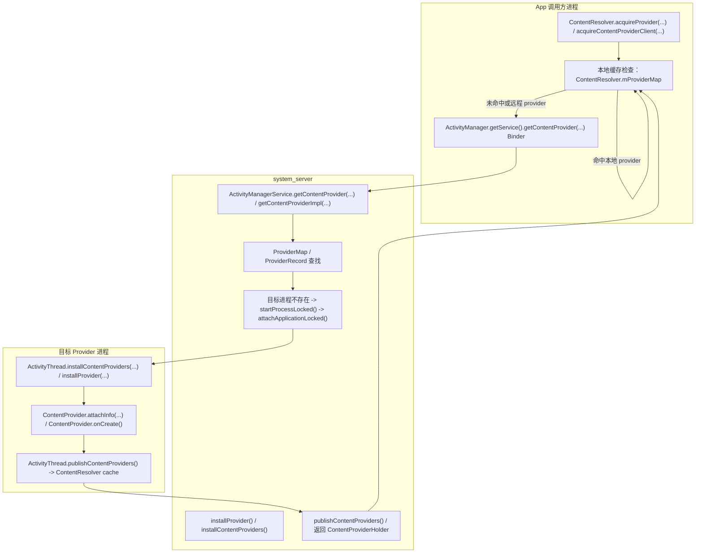

# ContentProvider 启动与发布流程（基于 android-latest-release 对应的 frameworks/base android16-qpr2-release 代码）

## 前言

ContentProvider 的启动链路介于 Activity 和 Service 之间：它既可能在 app 进程预装，也可能按需由另一个进程跨进程访问。
这篇文档用博客式逻辑讲 ContentProvider 的“启动、安装、发布、引用、重连”全流程，适合直接在 `frameworks/base` 里调试的同学。

## 你要先记住的 6 个核心结论

1. ContentProvider 既是一种组件，也是一种跨进程服务。它在 system_server 侧由 `ContentProviderRecord` 管理，在 app 侧由 `ContentProviderHolder` 和 `ContentProvider` 实例表示。
2. ContentProvider 启动分两种：按需启动（`ContentResolver.acquireProvider()`）和应用启动预安装（`ActivityThread.installContentProviders()`）。
3. system_server 侧的关键入口是 `ActivityManagerService.getContentProvider(...)`，app 侧的关键入口是 `ContentResolver.acquireProvider(...)` / `acquireContentProviderClient(...)`。
4. provider 的“发布”既包括 system_server 把 provider 绑定到进程，也包括 app 进程把 provider publish 给本地 `ContentResolver`。
5. ContentProvider 的引用分 `stable` 和 `unstable` 两类，它们影响 provider 进程是否保活、death 是否重连、以及资源释放策略。
6. 如果你要跟这个链路，最顺的路径是：`acquireProvider()` -> `getContentProvider()` -> `installContentProviders()` / `installProvider()` -> `publishContentProviders()`。

## 主流程图（按需启动 + 预装 + 发布）

## 真实代码顺序（按源码调用顺序）

1. `ContentResolver.acquireProvider(...)` / `acquireUnstableProvider(...)` 先检查本进程 `mProviderMap`。
   - 注释：本地缓存命中时直接复用 provider，避免跨进程调用。
2. 如果未命中，发起 Binder：`ActivityManager.getService().getContentProvider(...)`。
   - 注释：跨进程入口，将请求送到 system_server。
3. `ActivityManagerService.getContentProvider(...)` / `getContentProviderImpl(...)` 查找 `ProviderMap`。
   - 注释：system_server 侧根据 authority 查找已有 `ContentProviderRecord`。
4. 如果 provider record 不可用，则根据 authority / package 解析对应的 `ProviderInfo`。
   - 注释：这一步决定 provider 所在包、进程名、权限与初始化配置。
5. 如果目标进程未启动，使用 `startProcessLocked()` 拉起进程。
   - 注释：按需启动 provider 时，如果宿主进程不存在，就先冷启动该进程。
6. 目标进程 attach 后，`ActivityManagerService.attachApplicationLocked()` 调用 `installContentProviders()`。
   - 注释：attach 后继续 provider 安装，确保 provider 实例被创建并登记。
7. 目标进程在 `ActivityThread.installContentProviders()` / `installProvider()` 中创建 `ContentProvider` 实例，并执行 `attachInfo()` / `onCreate()`。
   - 注释：这里是 provider 真正进入应用进程并初始化的阶段。
8. 目标进程 `ActivityThread.publishContentProviders()` 把 provider 写入本地 `ContentResolver` 缓存。
   - 注释：把 provider 引用和 Binder 代理发布到本进程，便于后续快速复用。
9. system_server 返回 `ContentProviderHolder` / `IContentProvider` Binder 给调用者，客户端拿到代理后可以发起 `query()` / `insert()` 等 RPC。
   - 注释：返回结果是 provider 代理，后续访问走跨进程 `IContentProvider` 接口。

## 关键点拆解

### 1. app 端入口：`ContentResolver.acquireProvider(...)`

`acquireProvider()` 的核心逻辑是：

- 先检查本进程是否已经有 provider；
- 如果有，直接复用本地 provider；
- 如果没有，发起跨进程 Binder 到 AMS。

这一步决定了 provider 是本地调用还是远程调用。

### 2. system_server 入口：`ActivityManagerService.getContentProvider(...)`

这是 provider 启动链路的中心。

它会：

- 到 `ProviderMap` 查找已有 `ContentProviderRecord`；
- 根据 authority/uid 匹配 provider 信息；
- 如果 provider 不可用，尝试启动目标进程；
- 如果进程存在但 provider 未安装，调用 `installProvider(...)`。

对应源码：
- `frameworks/base/services/core/java/com/android/server/am/ActivityManagerService.java`

### 3. provider 的“安装”在哪？

目标进程里有两种安装方式：

- `ActivityThread.installContentProviders()`：应用启动时预装 manifest 声明的 providers；
- `ActivityThread.installProvider()`：运行时按需安装某个 provider。

无论哪种方式，都会走 `ContentProviderHolder.attachInfo()` 和 `ContentProvider.onCreate()`。

对应源码：
- `frameworks/base/core/java/android/app/ActivityThread.java`
- `frameworks/base/core/java/android/content/ContentProvider.java`

### 4. provider 发布到底是什么意思？

发布有两个层面：

- system_server 侧把 provider 绑定到进程，并记录 `ProviderRecord` / `ProviderMap`；
- app 进程侧把 provider 写入 `ActivityThread.mProviderMap`，并 publish 给 `ContentResolver`，让客户端可以直接拿到 `IContentProvider` 代理。

对应源码：
- `frameworks/base/core/java/android/app/ActivityThread.java`
- `frameworks/base/core/java/android/content/ContentResolver.java`

### 5. stable / unstable 引用的差异

- `acquireProvider(...)` 返回 stable provider，适合长期缓存；
- `acquireUnstableProvider(...)` 返回 unstable provider，适合临时访问。

区别在于：

- unstable provider 崩溃后系统会调用 `unstableProviderDied()`；
- stable provider 会让系统更倾向于保活 provider 进程；
- 释放引用时，stable 和 unstable 需要分别调用 `releaseProvider()` 和 `releaseUnstableProvider()`。

### 6. 预装与按需安装的分叉

`installContentProviders()` 通常在 `ActivityThread.handleBindApplication()` 之后执行，是应用启动时的预安装。
而 `acquireProvider()` 触发的请求则可能走 `installProvider()`，这是运行时按需加载的路径。

这就是为什么某些 provider 在 app 启动后已经可用，而另一些要等到首次访问才会真正创建。

### 7. authority / process 的匹配规则

关键判断点在 system_server：

- `ContentProviderRecord.info.authority` 用于匹配请求；
- `providerInfo.processName` 决定 provider 运行在哪个进程；
- `ProviderMap.findProviderLocked()` 负责从 authority/uid 查找 provider record。

如果该 provider 进程已经运行且 provider 已安装，则直接复用；否则会先拉起进程。

### 8. 访问时的 Binder 路径

客户端真正执行 `query()` / `insert()` / `update()` / `delete()` 时，走的是 `IContentProvider` Binder 接口。

- `ContentResolver.acquireProvider()` 拿到 `ContentProvider` 或 `ContentProviderClient`；
- 调用时会走 `IContentProvider` 的跨进程 RPC；
- 目标进程侧由 `ContentProviderTransport` / `ContentProviderNative` 接收，转到 provider 实例的方法。

## 常见问题与调试建议

- 先判断是本地 provider 还是远程 provider：看 `ContentResolver.mProviderMap` 是否命中。
- 如果发起 Binder，请看 `ActivityManagerService.getContentProvider(...)` 是否进入 `ProviderMap` 查找。
- 如果 provider 目标进程没有运行，关注 `startProcessLocked()` 和 `attachApplicationLocked()`。
- 如果目标进程启动后 provider 仍未创建，检查 `ActivityThread.installContentProviders()` 或 `installProvider()`。
- 如果 provider 崩溃后无法重连，关注 `unstableProviderDied()` 和 `releaseUnstableProvider()`。

## 参考源码定位清单

- `frameworks/base/core/java/android/content/ContentResolver.java`
- `frameworks/base/core/java/android/content/ContentProvider.java`
- `frameworks/base/core/java/android/app/ActivityThread.java`
- `frameworks/base/core/java/android/content/ContentProviderTransport.java`
- `frameworks/base/core/java/android/content/IContentProvider.aidl`
- `frameworks/base/services/core/java/com/android/server/am/ActivityManagerService.java`
- `frameworks/base/services/core/java/com/android/server/am/ProviderMap.java`
- `frameworks/base/services/core/java/com/android/server/am/ContentProviderRecord.java`
