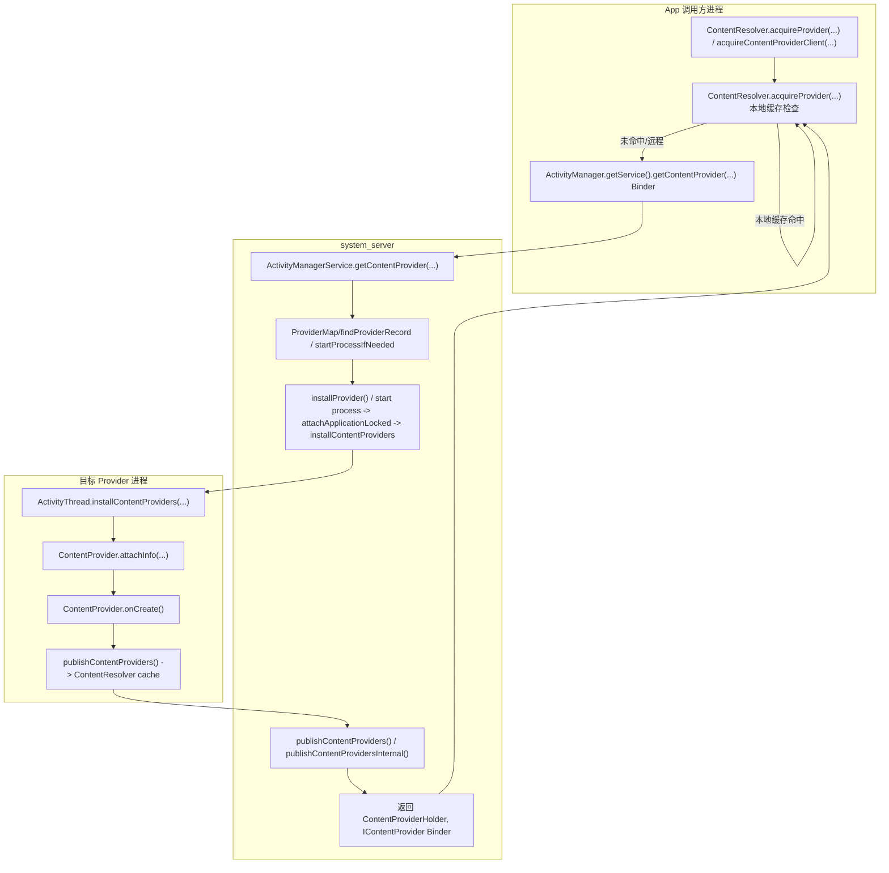

# ContentProvider 启动 / 发布流程（基于 frameworks/base 当前代码）

## 你需要先记住的 6 个概念

1. ContentProvider 是一种特殊组件，它既不是 Activity 也不是 Service，而是通过 `IContentProvider` Binder 接口提供进程间数据访问。
2. ContentProvider 的“启动”可以分成两类：
   - `ContentResolver.acquireProvider()` 触发的“按需启动/获取 provider”；
   - Application 启动时 `ActivityThread.installContentProviders()` 预先创建并发布 manifest 声明的 providers。
3. system_server 用 `ContentProviderRecord`/`ProviderMap` 描述 provider（系统侧元数据），而 app 进程用 `ContentProviderHolder`/`ContentProvider` 实例表示真正的 provider 对象。
4. provider 的“发布”有两层含义：
   - 系统侧把 provider 绑定到进程；
   - app 进程把 provider published 给 `ContentResolver` 缓存并建立 `IContentProvider` 代理。
5. ContentProvider client 引用分 `stable` 和 `unstable`，用于异步释放、dead provider 重试、远程 provider 生命周期管理。
6. provider 启动涉及 `ActivityManagerService.getContentProvider...`、`installContentProviders`、`publishContentProviders`、`ContentResolver.acquireProvider`，这个链路既有 system_server 的 provider record 管理，也有 app 进程的 provider 实例创建。

## 主流程图（按“按需启动 + 启动时预安装 + 发布/引用”）

## 技术细节（把“ContentProvider 启动/发布”拆成真正做的几件事）

### 1）app 侧到底怎么触发 ContentProvider？

客户端最常见入口是 `ContentResolver.acquireProvider(...)` / `acquireContentProviderClient(...)`，它会先检查本进程内的 provider 缓存：

- `ContentResolver.acquireProvider(Context, String authority, boolean stable)`
- `ContentResolver.acquireUnstableProvider(Context, String authority)`
- `ContentResolver.acquireContentProviderClient(...)`

关键行为：

- 先从 `mProviderMap` 查找已有 `ContentProviderHolder`。
- 本地 provider（即同一进程里已经安装的 provider）直接复用。
- 若未命中，则发起 Binder 到 AMS：`ActivityManager.getService().getContentProvider(...)`。

对应源码：

- `frameworks/base/core/java/android/content/ContentResolver.java`
  - `acquireProvider(...)`
  - `acquireUnstableProvider(...)`
  - `acquireContentProviderClient(...)`

### 2）system_server：AMS 如何找到/启动 provider？

`ActivityManagerService.getContentProvider(...)` 是系统侧的核心入口。

它的主要流程：

1. 先到 `ProviderMap` 查找是否已有 `ContentProviderRecord`。
2. 若已有并且 provider process 可用，则返回该 record 的 binder。
3. 若没有，则根据 `providerInfo.authority` / `providerInfo.processName` 找到对应 `ProviderInfo`。
4. 如果目标进程还没启动，先 `startProcessLocked(...)` 或 `startProcessLocked(... ensure)` 来拉起进程。
5. 调用 `installProvider(...)` 或 `publisher`，在目标进程里创建 provider 实例。
6. 把 `ContentProviderRecord` 的 `holder` 返回给调用方。

这其中的关键分支：

- `provider` 是否已经 published
- `process` 是否已经在运行
- 调用者是否要求 `stable` / `unstable`

对应源码：

- `frameworks/base/services/core/java/com/android/server/am/ActivityManagerService.java`
  - `getContentProvider(...)`
  - `getContentProviderImpl(...)`
  - `getContentProviderImplForUser(...)`
  - `installContentProviders(...)`
  - `installProvider(...)`
  - `publishContentProviders(...)`

### 3）“在 app 进程里创建 provider”到底是哪一步？

目标进程里 provider 的创建分两种情况：

- Application 启动时预安装：`ActivityThread.installContentProviders()`
- 运行时按需安装：`ActivityThread.installProvider(...)`

`installContentProviders()` 往往在 application attach 后执行，用于安装 manifest 中声明的 providers；
`installProvider()` 则可以在进程已经运行时安装谁也没有安装过的 provider。

创建 provider 的核心流程：

1. `ActivityThread.installContentProviders(...)` 接收来自 AMS 的 `List<ProviderInfo>`。
2. 遍历每个 provider，将其创建成 `ContentProvider` 实例。
3. 调用 `ContentProviderHolder.provider` 的 `attachInfo(...)`，把 `Application`、`ProviderInfo`、`ContentResolver` 等挂载上去。
4. 调用 `ContentProvider.onCreate()` 初始化 provider。
5. 将 provider 放入 `ActivityThread.mProviderMap`，并 publish 给本进程的 `ContentResolver`。

对应源码：

- `frameworks/base/core/java/android/app/ActivityThread.java`
  - `installContentProviders(...)`
  - `installProvider(...)`
  - `publishContentProviders(...)`
- `frameworks/base/core/java/android/content/ContentProvider.java`
  - `attachInfo(...)`
  - `onCreate()`

### 4）Provider 的“发布”是什么？

从系统角度，发布 provider 主要有两个层面：

- system_server 侧 provider 注册到 `ProviderMap` / `ContentProviderRecord`；
- app 进程侧 provider 通过 `ContentResolver` 缓存 `ContentProviderHolder`，并把其 binder 代理暴露给进程内 client。

在 app 进程里，`publishContentProviders()` 会把 `ContentProviderHolder` 中的 `provider` 写入 `mProviderMap`：

- `ActivityThread.mProviderMap.put(authority, holder)`
- `ContentResolver.registerProvider()` 将 `holder` 放入本地缓存

同时，系统会记录该 provider 的 `stable` / `unstable` 引用计数，方便后续 `releaseProvider()`、`releaseUnstableProvider()`、`unstableProviderDied()` 的处理。

对应源码：

- `frameworks/base/core/java/android/app/ActivityThread.java`
  - `publishContentProviders(...)`
- `frameworks/base/core/java/android/content/ContentResolver.java`
  - `registerContentProvider(...)`
  - `releaseProvider(...)`
  - `releaseUnstableProvider(...)`
  - `unstableProviderDied(...)`

### 5）stable / unstable 引用：为什么不是简单 Binder 计数？

ContentProvider 引用分为两种：

- `stable`：表示 client 认为 provider 是长期使用的，系统不会主动回收；
- `unstable`：表示 client 只短期使用，若 provider 进程崩溃可以快速重连或错误返回。

这两类引用的区别影响：

- AMS 侧是否把 provider 进程当做“保活目标”；
- provider death 时是否立即回调 `unstableProviderDied()`；
- `releaseProvider()` 与 `releaseUnstableProvider()` 的调用顺序。

对应源码：

- `frameworks/base/core/java/android/content/ContentResolver.java`
  - `acquireProvider(...)` / `acquireUnstableProvider(...)`
  - `releaseProvider(...)` / `releaseUnstableProvider(...)`
  - `unstableProviderDied(...)`
- `frameworks/base/services/core/java/com/android/server/am/ActivityManagerService.java`
  - `removeContentProvider(...)`
  - `unstableProviderDied(...)`

### 6）ContentProvider 的“预安装” vs “按需安装”

`installContentProviders()` 发生在 `ActivityThread.handleBindApplication()` 之后，由 system_server 在绑应用时下发：

- `ActivityManagerService.installContentProviders(...)` 在 `attachApplicationLocked()` 中调用；
- 结果返回给目标进程，目标进程执行 `ActivityThread.installContentProviders(...)`。

这个过程会把 manifest 中声明的 provider 一次性创建出来，并在应用启动完成前 publish。这样一来，后续本进程内访问该 provider 就是本地调用。

按需安装则在客户端首次调用 `ContentResolver.acquireProvider(...)` 时发生；若目标 provider 并未在进程内部安装，系统会通过 AMS `getContentProvider(...)` 请求 provider 所在 app 进程，再由 `installProvider()` 或 `installContentProviders()` 创建并 publish。

### 7）Provider name / authority / process 的匹配规则

关键判断点在 system_server：

- `ContentProviderRecord.info.authority` 用于匹配 `ContentResolver` 的 authority；
- `providerInfo.processName` 决定 provider 应该运行在哪个进程；
- `ProviderMap.getProviderByName()` / `findProviderLocked()` 负责从 authority/uid 解析 provider record。

如果 provider 在目标进程里已经存在且正在运行，AMS 会直接复用该 provider record；否则会尝试启动目标 process 并安装 provider。

对应源码：

- `frameworks/base/services/core/java/com/android/server/am/ProviderMap.java`
- `frameworks/base/services/core/java/com/android/server/am/ContentProviderRecord.java`

### 8）跨进程访问时的 Binder 路径

provider 发布后，客户端实际上持有的是 `IContentProvider` Binder 代理。

- `ContentResolver.acquireProvider()` 返回的 `ContentProvider` 或 `ContentProviderClient` 里封装了该 Binder；
- 应用进程调用 `query()` / `insert()` / `update()` / `delete()` 时，最终会走 `IContentProvider` 的跨进程 RPC；
- 目标进程的 `ContentProviderTransport` / `ContentProviderNative` 接收 Binder 调用，并转到 provider 对象执行对应方法。

对应源码：

- `frameworks/base/core/java/android/content/ContentProvider.java`
  - `query()` / `insert()` / `update()` / `delete()` 等接口
- `frameworks/base/core/java/android/content/ContentProviderTransport.java`
- `frameworks/base/core/java/android/content/IContentProvider.aidl`

### 9）provider 失败、death、重连的处理

当 provider 进程死亡或发生 binder error 时，系统做的主要工作：

- 若是 unstable 引用，client 会收到 `DeadObjectException` 或 `RemoteException`；
- `ContentResolver.uncaughtExceptionOnProvider` 会清理本地缓存并可能重试；
- system_server 调用 `ActivityManagerService.unstableProviderDied()`，将 provider record 标记为 dead，并在必要时移除 `ProviderMap` 中的 provider；
- 下一次 `acquireProvider()` 会重新走 `getContentProvider()` 链路。

对应源码：

- `frameworks/base/core/java/android/content/ContentResolver.java`
  - `uncaughtExceptionOnProvider(...)`
- `frameworks/base/services/core/java/com/android/server/am/ActivityManagerService.java`
  - `unstableProviderDied(...)`

## 逐函数状态机（真实代码顺序）

这部分按源码执行顺序把 provider 启动/发布拆成子阶段，方便你逐行单步跟进。

### 阶段 0：客户端准备与缓存检查

- `ContentResolver.acquireProvider(Context, String authority, boolean stable)`
- `ContentResolver.acquireUnstableProvider(Context, String authority)`
- 检查 `mProviderMap` 是否已有本地 `ContentProviderHolder`
- 若命中，则直接返回本地 provider；若未命中，则继续跨进程调用 AMS

### 阶段 1：Binder 到 system_server

- `ActivityManager.getService().getContentProvider(...)`
- `ActivityManagerService.getContentProvider(...)` 接收 Binder 请求
- `getContentProviderImplForUser(...)` / `getContentProviderImpl(...)` 做主体处理

### 阶段 2：系统侧查找 provider record

- `ProviderMap` 先按 authority/uid 搜索 `ContentProviderRecord`
- 若已有可用 record，则直接返回该 provider 记录
- 否则根据 package 解析目标 `ProviderInfo`

### 阶段 3：进程启动与 provider 安装

- 如果 provider process 未运行，先 `startProcessLocked(...)` 启动目标 app 进程
- 在 `ActivityManagerService.attachApplicationLocked(...)` 时，调用 `installContentProviders(...)` 安装 manifest 中的 provider
- 安装成功后，目标进程会向 system_server 注册 `ContentProviderHolder`

### 阶段 4：目标进程 publish provider

- `ActivityThread.installContentProviders(...)` 创建 provider 实例并 `attachInfo(...)`
- `ActivityThread.publishContentProviders(...)` 将 `ContentProviderHolder` 写入本进程 `mProviderMap`
- `ContentResolver` 本地缓存该 provider

### 阶段 5：返回 Binder 代理给客户端

- system_server 把 `ContentProviderHolder.provider.asBinder()` 或 `IContentProvider` 返回给调用方
- 客户端拿到 `IContentProvider`，封装成 `ContentProviderClient` / 内部 provider 代理

### 阶段 6：客户端发起具体访问

- `ContentProviderClient.query(...)` / `ContentResolver.query(...)`
- 通过 `IContentProvider` 进行 IPC
- 目标 provider 的 `ContentProviderTransport` 接收调用，转到 provider 实例的 `query()` / `insert()` 等方法

### 阶段 7：引用释放与 provider 退出

- 客户端调用 `releaseProvider(...)` / `releaseUnstableProvider(...)`
- `ContentResolver` 更新本地引用计数
- 若 `unstable` 引用为 0，system_server 侧可在 provider 长时间未使用时回收

## 关键分叉点（新手最容易迷路的地方）

### 分叉点 A：是“本进程 provider”还是“远程 provider”？

- 如果 `ContentProvider` 声明在当前进程并已安装，`ContentResolver.acquireProvider()` 直接命中本地缓存；
- 否则会发起 Binder 到 AMS，调用系统侧 `getContentProvider()`。

### 分叉点 B：是“已启动进程”还是“需要拉起进程”？

- `ActivityManagerService` 在 `ProviderMap` 查到 provider record 且 `provider.app` 有 `thread`，则直接返回；
- 否则会通过 `startProcessLocked()` 启动目标 app 进程，并在 `attachApplicationLocked()` 时安装 provider。

### 分叉点 C：是“manifest 预安装”还是“按需安装”？

- 预安装：app 启动时 `installContentProviders()` 一次性安装 manifest 中的 provider；
- 按需安装：客户端第一次访问 provider 时，如果进程运行但该 provider 未安装，则调用 `installProvider()`。

### 分叉点 D：stable / unstable 引用的选择

- `acquireProvider(...)` 返回 stable provider，适合长期缓存并反复使用；
- `acquireUnstableProvider(...)` 返回 unstable provider，适合临时访问且允许 provider 崩溃后快速重试。

## 新手调试建议

1. 先判断是“本进程 provider”还是“远程 provider”：检查 `ContentResolver.mProviderMap`、`ActivityThread.mProviderMap`。
2. 如果发起了 Binder，定位 `ActivityManagerService.getContentProvider(...)` 是否走到 `findProviderLocked()` / `installProvider()`。
3. 进程是否启动：看 `startProcessLocked()` 是否被调用，是否在 `attachApplicationLocked()` 里安装 provider。
4. 目标进程是否创建 provider：看 `ActivityThread.installContentProviders()` / `installProvider()` 的执行结果。
5. provider 是否 publish：看 `ActivityThread.publishContentProviders()` 是否把 `ContentProviderHolder` 放入本地 `mProviderMap`。
6. stable/unstable 引用问题：如果 provider 崩溃，关注 `unstableProviderDied()` 与 `releaseUnstableProvider()` 是否正确配对。

## 参考源码定位清单

- `frameworks/base/core/java/android/content/ContentResolver.java`
- `frameworks/base/core/java/android/content/ContentProvider.java`
- `frameworks/base/core/java/android/app/ActivityThread.java`
- `frameworks/base/core/java/android/content/ContentProviderTransport.java`
- `frameworks/base/core/java/android/content/IContentProvider.aidl`
- `frameworks/base/services/core/java/com/android/server/am/ActivityManagerService.java`
- `frameworks/base/services/core/java/com/android/server/am/ContentProviderRecord.java`
- `frameworks/base/services/core/java/com/android/server/am/ProviderMap.java`
- `frameworks/base/core/java/android/content/ContentProviderHolder.java`
